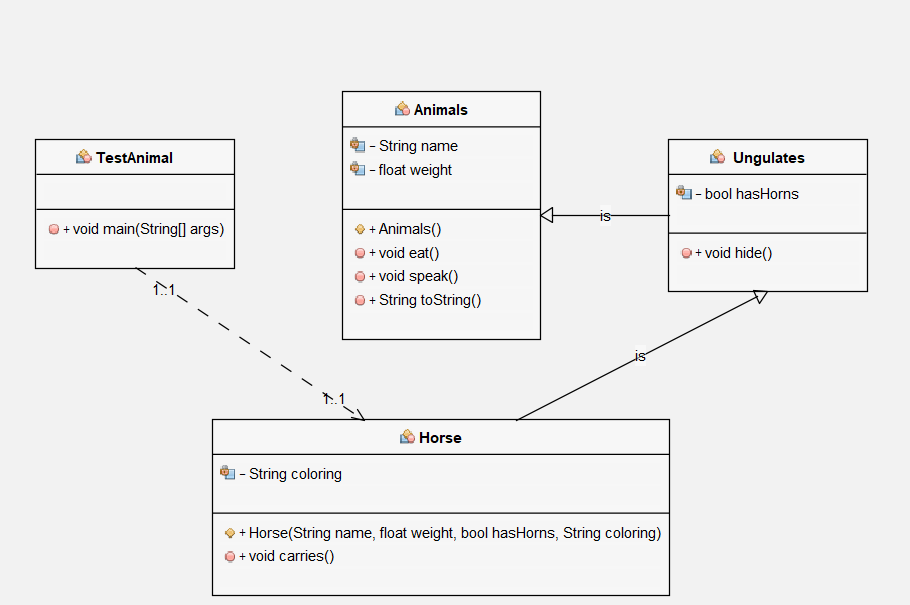
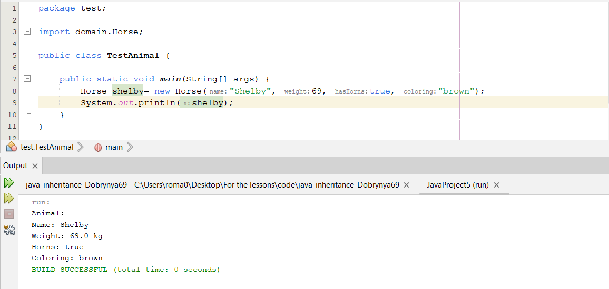

#### Діаграма

#### Результат програми

#### Класс Animal
```java
package domain;

public class Animal {

    protected String name;
    protected float weight;

    public Animal() {
        name="animal";
        weight=30;
    }

    public void eat() {
        System.out.println("Animal is eating...");
    }

    public void speak() {
        System.out.println("Animal is speaking...");
    }

    @Override
    public String toString() {
        return "Animal:" + "\nName: " + name + "\nWeight: " + weight+" kg";
    }
 
}
```
#### Класс Ungulates
```java
package domain;

public class Ungulates extends Animal{
    protected boolean hasHorns;
    
    public void hide(){
        System.out.println("Animal is hiding from predators...");
    }
}
```
#### Класс Horse
```java
package domain;

public class Horse extends Ungulates{
    protected String coloring;
    
    public Horse(String name, float weight, boolean hasHorns, String coloring){
        this.name = name;
        this.weight = weight;
        this.hasHorns = hasHorns;
        this.coloring = coloring;
    }
    
    public void carries(){
        System.out.println("Horse is carries a man...");
    }
    
    @Override
    public String toString() {
        return "Animal:" + "\nName: " + name + "\nWeight: " + weight+" kg" + "\nHorns: " + hasHorns + "\nColoring: " + coloring;
    }
}
```
#### Класс TestAnimal
```java
package test;

import domain.Horse;

public class TestAnimal {

    public static void main(String[] args) {
        Horse shelby= new Horse("Shelby", 69, true, "brown");
        System.out.println(shelby);
    }
}
```
